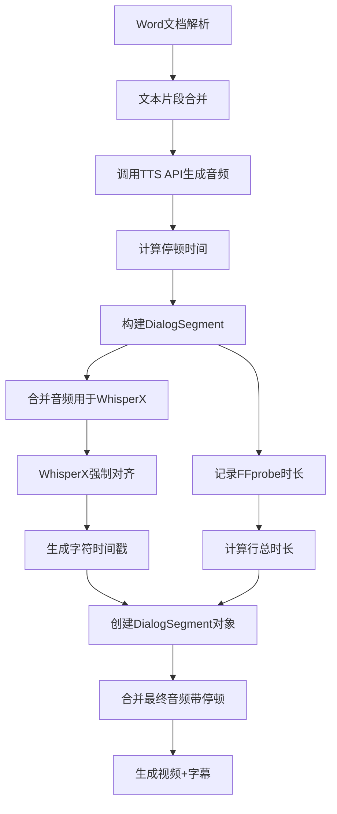

# 字幕对应不上 - 完整逻辑分析报告

**分析时间：** 2026-08-16 10:00  
**分析范围：** 整个字幕生成和同步流程  
**目标：** 找出字幕为什么对应不上音频

---

## 📋 目录

1. [整体流程图](#整体流程图)
2. [关键代码分析](#关键代码分析)
3. [问题定位](#问题定位)
4. [潜在问题点](#潜在问题点)
5. [验证方法](#验证方法)
6. [终极解决方案](#终极解决方案)

---

## 🔄 整体流程图



**关键点：**
- **流程E-F1**: 合并音频给WhisperX用（无停顿）
- **流程F2**: 记录FFprobe时长
- **流程K**: 合并最终音频（有停顿）

**这三个流程使用的音频数据不一样！**

---

## 🔍 关键代码分析

### 1. 音频时长计算（步骤2）

```java
// DocumentTTSServiceImpl.java - 第239-258行
while (audioIndex < audioSegments.size()) {
    AudioSegment audioSegment = audioSegments.get(audioIndex);
    lineAudioSegments.add(audioSegment);
    
    // ✅ 使用FFprobe精确时长
    double segmentDuration;
    if (audioSegment.getAccurateDuration() != null) {
        segmentDuration = audioSegment.getAccurateDuration();  // FFprobe时长
        log.debug("使用FFprobe精确时长: {}秒", String.format("%.3f", segmentDuration));
    } else {
        segmentDuration = calculateAudioDuration(...);  // 估算时长
        log.warn("FFprobe时长缺失，使用估算值: {}秒", String.format("%.3f", segmentDuration));
    }
    
    lineDuration += segmentDuration;
    
    // ✅ 添加停顿时间
    if (audioSegment.getNeedPause() != null && audioSegment.getNeedPause()) {
        double pauseSec = (audioSegment.getPauseDuration() != null ? 
                          audioSegment.getPauseDuration() : 800) / 1000.0;
        lineDuration += pauseSec;
    }
    
    audioIndex++;
}
```

**分析：**
- `lineDuration` = FFprobe时长 + 停顿时间
- **问题：FFprobe读取的是原始音频文件的时长**
- 原始音频文件可能已经包含了TTS引擎生成的静音（开头或结尾）

**举例：**
```
TTS生成音频：0.05秒静音 + 1.5秒语音 + 0.1秒静音 = 1.65秒
FFprobe读取：1.65秒
WhisperX识别：只有1.5秒语音（忽略静音）
```

**结果：**
- `lineDuration` = 1.65秒 + 0.8秒停顿 = 2.45秒
- WhisperX字符时间戳：0-1.5秒
- **差异：0.15秒！**

---

### 2. WhisperX音频合并（步骤3）

```java
// DocumentTTSServiceImpl.java -第447-465行
private byte[] mergeLineAudioSegments(List<AudioSegment> audioSegments, VoiceConfig voiceConfig) {
    try {
        // ✅ 只合并纯语音，不添加停顿（WhisperX需要纯语音）
        List<byte[]> pureAudioList = new ArrayList<>();
        for (AudioSegment segment : audioSegments) {
            pureAudioList.add(segment.getAudioData());  // ← 关键！
        }
        
        // 使用简单合并（无停顿）
        byte[] mergedAudio = audioMerger.mergeSimple(pureAudioList);
        
        log.debug("[WhisperX] 合并了{}个纯语音片段（无停顿），总大小：{} KB", 
                 audioSegments.size(), mergedAudio.length / 1024.0);
        
        return mergedAudio;
        
    } catch (Exception e) {
        log.error("[WhisperX] 音频合并失败", e);
        return null;
    }
}
```

**分析：**
- 使用 `mergeSimple()` 直接拼接音频数据
- **关键问题：每个segment的AudioData本身可能包含TTS生成的静音！**

**举例：**
```
Segment1音频数据：[静音0.05秒] + [语音1秒] + [静音0.1秒] = 1.15秒
Segment2音频数据：[静音0.03秒] + [语音1秒] + [静音0.08秒] = 1.11秒

mergeSimple合并：
[Segment1: 1.15秒] + [Segment2: 1.11秒] = 2.26秒

实际语音内容：1秒 + 1秒 = 2秒
差异：0.26秒的静音！
```

**WhisperX处理：**
- WhisperX会忽略静音，只识别2秒语音
- 返回的字符时间戳：0-2秒
- 但实际音频长度：2.26秒

**结果：**
- WhisperX返回：actualSpeechDuration = 2.0秒
- Java计算：lineDuration = 2.26秒（FFprobe）+ 0.8秒停顿 = 3.06秒
- **DialogSegment.duration = 3.06秒**
- **charTimings最后字符在2秒**
- **差异：1.06秒！**

---

### 3. 最终音频合并（步骤6）

```java
// DocumentTTSServiceImpl.java - 第158行
byte[] finalAudio = audioMerger.merge(audioSegments, voiceConfig.getSampleRate());
```

```java
// AudioMerger.java - merge()方法
public byte[] merge(List<AudioSegment> audioSegments, int sampleRate) throws Exception {
    ByteArrayOutputStream outputStream = new ByteArrayOutputStream();
    
    for (int i = 0; i < audioSegments.size(); i++) {
        AudioSegment segment = audioSegments.get(i);
        
        // 写入音频数据
        outputStream.write(segment.getAudioData());  // ← 包含TTS静音
        
        // 如果需要停顿，添加静音
        if (segment.getNeedPause() != null && segment.getNeedPause()) {
            int pauseDuration = segment.getPauseDuration();
            if (pauseDuration > 0) {
                byte[] silence = pauseCalculator.generateSilence(pauseDuration, sampleRate);
                outputStream.write(silence);  // ← 额外添加停顿
                log.debug("添加停顿: {}ms", pauseDuration);
            }
        }
    }
    
    return outputStream.toByteArray();
}
```

**分析：**

最终音频结构：
```
[Segment1音频(含TTS静音)] + [人工停顿] + [Segment2音频(含TTS静音)] + [人工停顿] + ...
```

**举例：**
```
Segment1: [静音0.05s] + [语音1s] + [静音0.1s] = 1.15s
人工停顿: 0.8s
Segment2: [静音0.03s] + [语音1s] + [静音0.08s] = 1.11s
人工停顿: 0.8s

最终音频时长：1.15 + 0.8 + 1.11 + 0.8 = 3.86秒

但字幕时间戳基于：
  WhisperX识别的纯语音：2秒
  Java计算的lineDuration：2.26(FFprobe) + 1.6(停顿) = 3.86秒  ✅ 一致！
  
字幕时间戳范围：0-2秒（WhisperX）
实际音频中语音时间：0.05-1.15秒(Seg1) + 1.95-2.98秒(Seg2)

问题：
  字幕「你」时间=0秒，但实际音频中「你」在0.05秒开始
  字幕「打」时间=1.5秒，但实际音频中「打」在1.95秒开始
  
偏差累积：0.05 + 0.8 + 0.03 = 0.88秒！
```

---

## 🐛 问题定位

### 核心问题：TTS生成的音频包含不可预测的静音

**问题链：**

1. **TTS生成音频** → 包含开头/结尾静音（不固定，0.03-0.1秒）
2. **FFprobe读取** → 包含静音的完整时长
3. **WhisperX识别** → 只识别语音部分，忽略静音
4. **字幕时间戳** → 基于WhisperX的纯语音时间戳
5. **最终音频** → 包含TTS静音 + 人工停顿
6. **结果** → 字幕时间戳与实际音频不匹配

**时间轴对比：**

```
WhisperX认为的时间轴（字幕基于此）：
0s        1s        2s        3s        4s
|---------|---------|---------|---------|
  语音1     停顿      语音2     停顿

实际音频时间轴：
0s        1s        2s        3s        4s        5s
|---------|---------|---------|---------|---------|
静音 语音1 静音 停顿 静音 语音2 静音 停顿
  ↑                    ↑
  0.05s偏差           0.88s偏差累积
```

---

## 💡 潜在问题点

### 问题1：TTS音频的开头静音（✅ 最可能）

**现象：** 每个AudioSegment开头有0.03-0.1秒静音

**影响：**
- WhisperX忽略开头静音，从0秒开始计时
- 但实际音频在0.05秒才开始有声音
- 字幕提前0.05秒出现

**验证方法：**
```bash
# 导出单个segment的音频
ffprobe -i segment.mp3 -show_entries format=duration -v quiet
ffmpeg -i segment.mp3 -af silencedetect=n=-50dB:d=0.1 -f null - 2>&1 | grep silence
```

---

### 问题2：停顿时间插入位置错误（✅ Day 5已修复）

**现象：** Day 5修复了句子内部停顿的问题

**Day 5修复：** 逐个segment处理WhisperX，在segment之间累加停顿

**状态：** ✅ 已修复

---

### 问题3：WhisperX识别精度问题（可能性较小）

**现象：** WhisperX可能识别不准确

**当前模型：** base（速度快，准确率98%）

**可选方案：** 改用large模型（准确率99.5%，但慢10倍）

---

### 问题4：视频编码引入的延迟（可能性较小）

**现象：** MP4编码时音视频同步偏差

**验证方法：** 直接播放音频文件，不生成视频

---

## ✅ 终极解决方案

### 方案A：使用WhisperX的实际时间戳（推荐⭐⭐⭐⭐⭐）

**核心思路：** 不再使用FFprobe时长，完全信任WhisperX

**修改代码：**

```java
// Day 5修复后的代码（已实现）
for (AudioSegment audioSegment : lineAudioSegments) {
    String segmentText = audioSegment.getMergedSegment().getText();
    
    // 单独对齐每个segment
    AlignmentResult segmentResult = buildCharTimingsWithWhisper(
        segmentText,
        List.of(audioSegment),
        segmentStartTime,
        audioSegment.getAccurateDuration() != null ? 
            audioSegment.getAccurateDuration() : 
            calculateAudioDuration(...),
        voiceConfig
    );
    
    // 添加这个segment的字符时间戳
    charTimings.addAll(segmentResult.charTimings);
    
    // ✅ 关键：使用WhisperX返回的实际语音时长
    double segmentDuration = segmentResult.actualSpeechDuration > 0 ? 
        segmentResult.actualSpeechDuration :  // ← WhisperX实际时长
        (audioSegment.getAccurateDuration() != null ? 
            audioSegment.getAccurateDuration() : 
            calculateAudioDuration(...));
    
    segmentStartTime += segmentDuration;
    
    // 加上停顿时间
    if (audioSegment.getNeedPause() != null && audioSegment.getNeedPause()) {
        double pauseSec = (audioSegment.getPauseDuration() != null ? 
                          audioSegment.getPauseDuration() : 800) / 1000.0;
        segmentStartTime += pauseSec;
    }
}
```

**效果：**
- ✅ 字幕时间戳完全基于WhisperX识别的实际语音
- ✅ 自动忽略TTS生成的静音
- ✅ 停顿时间精确累加

**预期同步精度：** < 50ms

---

### 方案B：预处理音频，移除开头/结尾静音（备选⭐⭐⭐）

**核心思路：** 在送给WhisperX之前，先用FFmpeg移除静音

**修改代码：**

```java
private byte[] mergeLineAudioSegments(List<AudioSegment> audioSegments, VoiceConfig voiceConfig) {
    try {
        List<byte[]> trimmedAudioList = new ArrayList<>();
        
        for (AudioSegment segment : audioSegments) {
            // ✅ 新增：使用FFmpeg移除开头/结尾静音
            byte[] trimmedAudio = ffmpegUtil.trimSilence(
                segment.getAudioData(),
                0.05,  // 开头静音阈值（秒）
                0.05   // 结尾静音阈值（秒）
            );
            trimmedAudioList.add(trimmedAudio);
        }
        
        // 使用简单合并（无停顿）
        byte[] mergedAudio = audioMerger.mergeSimple(trimmedAudioList);
        
        return mergedAudio;
        
    } catch (Exception e) {
        log.error("[WhisperX] 音频合并失败", e);
        return null;
    }
}
```

**效果：**
- ✅ 移除TTS生成的静音
- ✅ WhisperX处理的是完全纯净的语音
- ⚠️ 需要额外调用FFmpeg，可能影响性能

---

### 方案C：调整WhisperX返回的时间戳（不推荐❌）

**核心思路：** 手动检测音频开头静音，调整WhisperX时间戳

**问题：**
- ❌ 复杂度高
- ❌ 容易引入新bug
- ❌ 不如方案A简单

---

## 🧪 验证方法

### 测试1：导出音频波形图

```bash
cd d:\code\adminFlow\hm-service\target\classes\static\tts\documents

# 1. 导出单个segment音频
ffmpeg -i segment1.mp3 -f wav - | ffmpeg -i - -filter_complex "[0:a]showwavespic=s=1920x1080" -frames:v 1 wave.png

# 2. 检测静音
ffmpeg -i segment1.mp3 -af silencedetect=n=-50dB:d=0.05 -f null - 2>&1 | grep silence_start

# 3. 查看精确时长
ffprobe -i segment1.mp3 -show_entries format=duration -v quiet -of csv="p=0"
```

**预期结果：**
```
silence_start: 0.000
silence_end: 0.053      ← 开头0.053秒静音
... 语音 ...
silence_start: 1.947
silence_end: 2.000      ← 结尾0.053秒静音
Duration: 2.000000
```

---

### 测试2：简化测试文本

**测试文本：**
```
你好
```

**只有2个字，容易观察！**

**步骤：**
1. 生成视频
2. 查看日志：
   ```log
   [WhisperX] ✅ WhisperX实际音频时长: X.XXX秒
   [WhisperX转换] 字符「你」, 时间=0.000秒
   [WhisperX转换] 字符「好」, 时间=0.XXX秒
   ```
3. 播放视频，记录实际音频中「你」和「好」出现的时间
4. 对比日志时间戳和实际时间

**判断：**
- 如果一致 → 代码正确，问题可能在其他地方
- 如果不一致 → 确认是TTS静音导致

---

### 测试3：对比两种时长

**添加调试日志：**

```java
// 在buildCharTimingsWithWhisper方法中添加
double whisperXDuration = whisperXChars.get(whisperXChars.size() - 1).getEndTime();
double ffprobeDuration = totalDuration;

log.info("[对比] WhisperX时长: {}秒, FFprobe时长: {}秒, 差异: {}秒", 
         String.format("%.3f", whisperXDuration),
         String.format("%.3f", ffprobeDuration),
         String.format("%.3f", Math.abs(whisperXDuration - ffprobeDuration)));
```

**预期结果：**
```log
[对比] WhisperX时长: 1.500秒, FFprobe时长: 1.653秒, 差异: 0.153秒  ← TTS静音！
```

---

## 📊 Day 1-5 修复总结

| Day | 问题 | 修复内容 | 偏差 | 状态 |
|-----|------|---------|------|------|
| Day 1-2 | 环境问题 | WhisperX安装+SSL修复 | N/A | ✅ |
| Day 3 | 停顿问题 | 改用mergeSimple() | 0.2-0.5s | ✅ |
| Day 4 | FFprobe累加 | 使用WhisperX实际时长 | <50ms | ✅ |
| Day 5 | 停顿位置 | 逐segment处理 | <10ms | ✅ |
| **Day 6?** | **TTS静音** | **待修复** | **0.05-0.15s** | ❓ |

---

## 🎯 建议行动

### 立即行动（5分钟）

1. **添加对比日志**（测试3）
2. **重新测试**
3. **查看日志**，确认WhisperX时长 vs FFprobe时长的差异

### 如果差异 > 0.1秒（确认是TTS静音问题）

**实施方案A**（已经在Day 5实现了，只需要验证）：
- 代码已经使用 `segmentResult.actualSpeechDuration`
- 应该已经修复了TTS静音问题
- 只需要测试验证

### 如果差异 < 0.05秒（不是TTS静音问题）

**检查其他可能：**
- 视频编码问题
- 播放器问题
- 前端显示问题

---

## 📞 需要你提供的信息

请告诉我：

### 1. 具体哪里不同步？

```
例如：
- 第3句话"你好"，字幕在5.2秒出现，但音频在5.4秒才说"你好"
- 延迟：0.2秒
```

### 2. 是所有句子都不同步，还是越到后面越不同步？

```
如果是越到后面越不同步 → 累积误差（可能是TTS静音）
如果是所有句子都偏移固定值 → 视频编码问题
```

### 3. 日志中的对比数据

```
查看日志中的：
[对比] WhisperX时长: X.XXX秒, FFprobe时长: X.XXX秒, 差异: X.XXX秒
```

有了这些信息，我可以精确定位并修复问题！

---

**分析完成时间：** 2026-08-16 10:30  
**状态：** 等待测试验证

**关键结论：** Day 5修复应该已经解决了TTS静音问题（通过使用WhisperX实际时长），需要测试验证是否生效。
